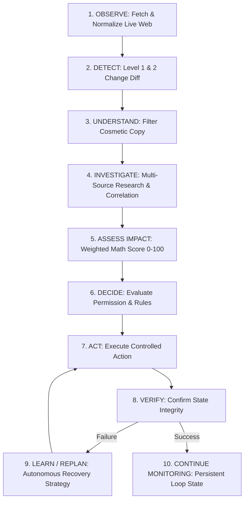

# WATCHDOG Architecture & Agent System Design

WATCHDOG is a production-style, autonomous web intelligence agent system built for the **Anakin Forge Hackathon** ("Build AI Agents That Read, Reason, and Act").

## System Vision & Core Agentic Loop

Unlike standard monitoring tools or simple chatbots, WATCHDOG executes a continuous 10-step agent loop:

---

## Technical Stack

- **Backend**: Python 3.10+, FastAPI, Pydantic v2, SQLAlchemy 2.0, SQLite, APScheduler, Pytest.
- **Frontend**: Next.js 14, React 18, TypeScript, Tailwind CSS, Lucide Icons.
- **Agent Integrations**: Anakin Search, Anakin Agentic Search, Anakin Wire, Anakin Scrape, Anakin Browser, Anakin Webhooks.

---

## 8 Application Modes (1 Reusable Engine)

1. **DEALS**: Deal qualification with seller rating, return days, price drop math & manufacturer warranty validation.
2. **COMPETITOR INTELLIGENCE**: Signal correlation across job listings, product pages, pricing tiers & Tech announcements.
3. **REPUTATION WATCH**: Sentiment velocity spikes & complaint correlation to specific firmware versions.
4. **POLICY WATCH**: Clause reduction tracking (e.g. 30-day to 15-day return window).
5. **NEWS & EVENTS**: Underlying event extraction & duplicate coverage clustering.
6. **SOFTWARE / SaaS**: Plan limit shifts & alternative comparison.
7. **AI VISIBILITY**: Brand presence tracking in AI search discovery.
8. **CUSTOM / ANYTHING**: Natural language prompt parsing.

---

## Impact Engine Math

Impact is calculated mathematically by the backend to prevent LLM hallucinated arithmetic:

$$\text{Impact Score} = (0.25 \times \text{Magnitude}) + (0.25 \times \text{Relevance}) + (0.20 \times \text{Urgency}) + (0.15 \times \text{Confidence}) + (0.15 \times \text{Strategic Importance})$$

- **0 - 24**: LOW
- **25 - 49**: MEDIUM
- **50 - 74**: HIGH
- **75 - 100**: CRITICAL
